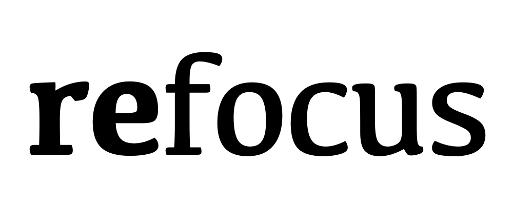

by George Sarkees ([gasthree@gmail.com](mailto:gasthree@gmail.com))

A personal home dashboard for Raspberry Pi.

## Features

- 📅 Google Calendar integration
- 🌤️ Weather display with smart alerts
- 📸 Photo slideshow
- ⏰ Date and time
- 🎯 Event countdowns
- 🗑️ Chores and reminders

## Requirements

- Raspberry Pi
- Portrait display (1080×1920 recommended)

## Setup

1. Deploy to Pi using the provided scripts
2. Complete setup wizard via QR code on your phone
3. Dashboard displays automatically in kiosk mode

## License

Personal use only. See [Terms of Service](docs/TERMS_OF_SERVICE.html) and [Privacy Policy](docs/PRIVACY_POLICY.html).
